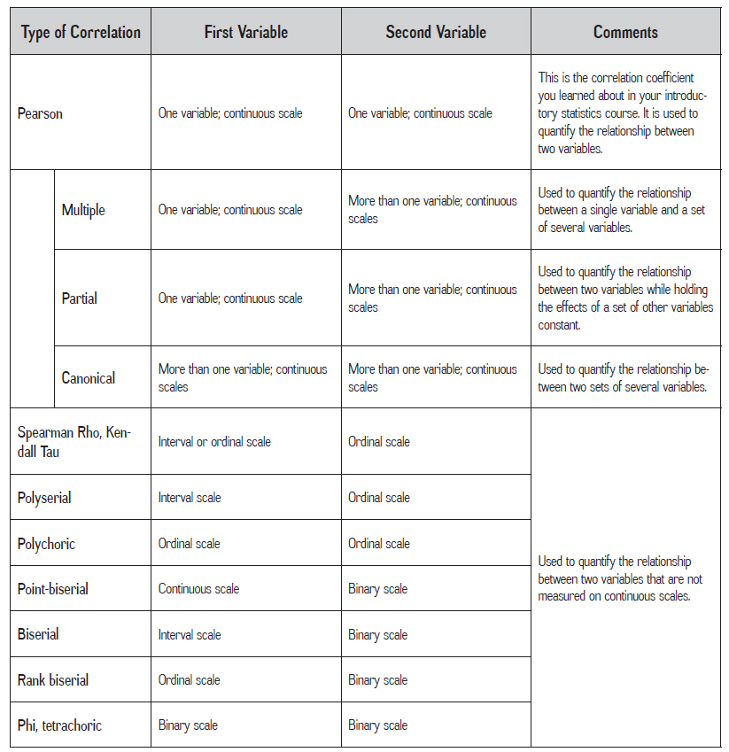

```{r setup, include=FALSE}

## Global options
knitr::opts_chunk$set(echo=TRUE,
        	            cache=FALSE,
                      prompt=FALSE,
                      comment=NA,
                      message=FALSE,
                      warning=FALSE,
                      class.source="bg-info",
                      class.output="bg-warning")

```


# Préambule {-}

Cette fiche ne constitue pas un cours sur les coefficients de corrélation, si un rappel théorique est réalisé, il reste superficiel.  Néanmoins, certains concepts statistiques sont nécessaires pour aborder le sujet. Ces concepts feront l'objet d'un glossaire en fin de fiche et seront identifiés par un numéro en indice.
<br>
Par ailleurs, il ne s'agit pas non plus de présenter une méthode qui serait __LA__ méthode pour réaliser des analyses de corrélation avec R.
</br>
L'objectif de cette fiche est de présenter étape par étape une méthodologie personnelle efficace et reproductible pour l'analyse des corrélations. 

<br>

# Qu'est ce qu'une corrélation ?

## Ce n'est pas une régression !

**La corrélation, contrairement à la régression^[__Une régression__ renvoie à un ensemble de tests statistiques dont l'objectif est de prèdire les valeurs prisent par une variable en fonction d'une ou plusieurs autres variables] étudie un lien et non une causalité. La corrélation nous permet de déterminer l'absence ou la présence d'une relation, d'un lien significatif entre 2 variables**.


<div class="alert alert-danger" role="alert">
La corrélation est une quantification de la relation entre des variables. Le calcul du coefficient de corrélation repose sur le calcul de la covariance ^[__La covariance__ en statistique est une valeur qui est une mesure de la variation simultanée de deux variables] entre les variables. Le coefficient de corrélation est en fait la standardisation ^[__La standardisation__ est une transformation de la donnée qui la rendra compatible avec une distribution moyenne de 0 et un écart type de 1. Pour ce faire on soustrait à chaque valeur une valeur de référence (très souvent la moyenne) et on divise par l'écart-type. Vous pourrez aussi trouver les termes de normalisation ou de Centrer-réduire] de la covariance. Cette standardisation permet d'obtenir une valeur qui variera toujours entre -1 et +1, peu importe l'échelle de mesure des variables mises en relation.
</div>


Cette notion de covariance est importante, elle est au cœur du concept de corrélation. Lorsque l'on mesure une corrélation on étudie la variation commune des variables.
On peut théoriquement mesurer une corrélation entre n'importe quelle variable. Il est possible de s'amuser à calculer la corrélation entre le nombre de suicides par strangulation aux États-Unis et le niveau d’investissement du gouvernement américain dans la recherche :

<br>

<p class="center">[](http://tylervigen.com/spurious-correlations){target="_blank"} </p>

On remarque une trajectoire commune. **Il existe statistiquement une relation forte entre ces deux variables mais cela n'implique en aucun cas que l’une est la cause de l’autre**.

<div class="alert alert-info" role="alert">
Pour comprendre plus aisément cette différence entre lien et cause, je vous conseille de visiter le site <a href="http://tylervigen.com/spurious-correlations" target="_blank">__spurious-correlations__ </a> qui recense des corrélations très fortes entre des variables qui ont donc un lien statistique mais où il serait aberrant d'en déduire une relation de cause à effet.
</div>

<br>

## Quels types de corrélations?

Il existe plusieurs méthodes de calcul pour analyser des corrélations. Le choix d'un coefficient est determiné par les spécificités des variables étudiées.
__Un mauvais choix risque de fausser vos résultats et vos interprétations.__

Pour faire le bon choix, vous devez prendre en compte : 

* Les **types de variables** (quantitative, qualitative)
* Les formats de stockage (numérique, chaîne de caractère et facteur)
* La **forme des distributions** des séries statistiques analysées

Voci un tableau recensant différents types de coefficients de corrélation parmi les plus courants.

<p class="center"> </p>

Nous ne ferons pas ici un point statistique sur chacun de ces coefficients et n'aborderons pas les soubassements algébriques de ces tests. Toutefois, il est bon de savoir et de se rappeller qu'il exite différents types de coefficients de correlation et qu'il faudra choisir celui à utiliser en fonction des variables à analyser.

Les coefficients de corrélation les plus connus et utilisés en SHS sont :

* Le *R* de Bravais-Pearson
* Le *Rho* de Spearman
* Le *Tau* de Kendall

Ainsi, si vous cherchez à étudier une relation linéaire entre **deux variables quantitatives et continues et qu'au moins l'une des deux suit une distribution normale ^[__Une distribution normale__ renvoie à une manière dont se distribuent vos données et qui rentrerait dans le cadre d'une loi normale. On parle également de loi de Gauss. En statistique, il s'agit d'une loi de probabilité. Elle est dite normale car elle permet de modéliser un grand nombre de distributions statistiques observées (taille, poids...). Les lois de probabilités sont utiles car permettent de modéliser les "phénomènes naturels" issus d'événements aléatoires.]**, vous aurez l’immense honneur de pouvoir réaliser un calcul du coefficient de corrélation de Pearson. Il s'agit du coefficient de référence lorsque l'on parle de corrélation.

En revanche, si :

* **Vos données ne suivent pas une loi normale**,
* Et qu'**elles sont qualitatives**.

Adieu Pearson et bonjour Spearman ou Kendall (entre autres).
Rassurez vous, ces tests fonctionnent très bien ! En revanche, on ne sera pas sur l’étude d’une relation linéaire comme dans le cas de Pearson, mais sur une comparaison des rangs ^[__Un rang__ est ici un nombre consécutif affecté à une observation spécifique dans notre échantillon d'observations triées selon leurs valeurs].

À dire vrai, d’un point de vue statistique, elles sont même considérées comme des méthodes plus robustes car ne dépendant pas de la distribution des données.
Ces coefficients vous seront donc très utiles dans le cas où l'analyse du nuage de points révèle une forme curviligne dans une relation qui semble mal s'ajuster à la fameuse droite de régression^[__La droite de régression__ est un graphique linéaire représentant la corrélation théorique entre deux variables].


On peut signaler que :

* Le coefficient de Spearman se lit comme le coefficient de Pearson, en simplifiant largement on peut considérer qu'il s'agit de son adaptation pour les tests non-paramétriques.
* Alors que le coefficient de Kendall se lit comme une probabilité. Précisément, c'est la différence entre la probabilité que les données observées soient dans le même ordre pour les deux variables versus la probabilité que les données observées soient dans des ordres différents pour les deux variables.

Par ailleurs, dans certaines disciplines (comme par exemple en psychologie) on considère que Spearman s'utilise dans le cas de variables ordinales où la distance "ressentie" entre les classes de nos données qualitative est la même entre tous les intervalles (par exemple les réponses aux échelles de Likert^[__Une échelle de Likert__ est un outil psychométrique permettant de mesurer une attitude chez des individus. Elle tire son nom du psychologue américain Rensis Likert qui l'a développée. Elle consiste en une ou plusieurs affirmations pour lesquelles la personne interrogée exprime son degré d'accord ou de désaccord.])

En plus de Pearson, Spearman et Kendall que nous retrouverons 8 fois sur 10, il existe d'autres tests de corrélation peu connus en SHS mais qui peuvent s'avérer très utiles, notamment dans le cas où vous voudriez étudier __le lien entre des variables quantitatives et qualitatives__.
A savoir les coefficients de corrélation : Bisériel de point et Bisériel (Point-Biserial et Biserial en anglais) 

<div class="alert alert-info" role="alert">
Bisériel de point : coefficient permettant d'étudier le lien entre une variable qualitative dichotomique et une variable quantitative continue. Coefficient qui est mathématiquement équivalent à Pearson.
<hr>
Bisériel : utilisé également pour étudier un lien entre une variable quantitative et une variable dichotomique. Ce test s'emploi à la place du Bisériel de point lorsque l'on considére que la variable dichotomique possède une continuité sous-jacente. Souvent le cas pour une variable qui peut être mésurée de manière continue ou ordinale mais artifiecellement dichotomisé, par exemple: un niveau de stress mesurée de manière dichotomique (niveau bas VS niveau haut) mais qui aurait pu être mésuré à l'aide d'un score ou de catégories.
</div>


<br>

## Interprétation d'une corrélation

### Le coefficient de corrélation

Si nous reprenons l'exemple cité précédemment en partie 1.1 sur le lien entre le nombre de suicides par strangulation aux États-Unis et le niveau d'investissement du gouvernement américain dans la recherche, ce coefficient de corrélation peut :


1. **être supérieur à 0** : les variables sont associées positivement, plus les investissements dans la recherche augmentent, plus le nombre de suicides par strangulation augmente et inversement ;
1. **être inférieur à 0** : les variables sont associées négativement, plus les investissements dans la recherche augmentent, plus le nombre de suicides par strangulation diminue, et inversement;
1. **être égale à 0** : il n'y a absolument aucun lien entre les variables, le niveau d'investissement dans la recherche n'a strictement aucune influence sur le nombre de suicides par strangulation, et inversement.


**Deux informations importantes sont donc à analyser** :

* __Le sens de la relation__ : La corrélation est-elle positive ou négative (coefficient supérieur ou inférieur à 0) ?
* __La force de la relation__ : Plus la valeur du coefficient est proche de + 1 ou de - 1, plus les deux variables sont associées fortement. Au contraire, plus le coefficient est près de 0, moins les variables partagent de covariance et donc, moins l'association est forte.

Voici une figure récapitulative : 

<p class="center"> </p>

Dans certaines disciplines des SHS on utilise les bornes de Cohen pour juger de la force d'une corrélation (Cohen, 1988) :

    + Autour de 0.10 : effet de petite taille (corrélation faible)     
    + Autour de 0.30 : effet de taille moyenne (corrélation moyenne)    
    + Plus de 0.50 : effet de grande taille (corrélation forte)    


<br>

### p-value et Hypothèse nulle

Le $p$ (ou encore $p-value$ ) correspond à la notion de risque d'erreur.

Le $p$ représente la probabilité du risque d'erreur associé à notre test statistique. C'est en fait la probabilité que le résultat de notre test soit dû au hasard.
Le $p$ est important car c'est en fonction de sa valeur que nous pourrons dire si le résultat de notre test statistique peut être considéré comme fiable ou en réalité dû au hasard.
<br>
Pour être interprété, le coefficient de corrélation doit être significatif (la valeur de $p$ doit être a minima plus petite que 0,05, ce qui représente un risque de 5% de se tromper). Si le coefficient est non significatif, on considère alors qu'il est semblable à un coefficient = 0, c'est-à-dire qu'on ne peut pas considérer l'existence d'un lien.


<div class="alert alert-info" role="alert">
Si votre $p$ est entre 0.05 et 0.1, vous pouvez éventuellement parler d’un effet tendanciel, bien que non significatif votre corrélation indique une tendance et il ne faut donc pas rejeter complètement cette corrélation. Là encore, il s'agit de pratiques qui diffèrent en fonction des disciplines.
<hr>
En SHS la limite à partir de laquelle nous considérons en général le test comme fiable est fixée à 5%. Comme expliqué il s'agit du seuil de significativité. Ce seuil est le risque d'erreur que nous considérons comme acceptable. Toutefois dans certaines disciplines, notamment en santé, ce seuil est abaissé à 1% voire 0.1%.
</div>

Le calcul d'une corrélation est un test d'hypothèse^[__Un test d’hypothèse__ (ou test statistique) est une démarche qui a pour but de fournir une règle de décision permettant, sur la base de résultats d’échantillon, de faire un choix entre deux hypothèses statistiques], il s'accompagne donc d'une hypothèse nulle^[__L'hypothèse nulle__ (aussi appellée H0) est la base des tests statistiques. Cette hypothèse postule l'égalité entre des paramètres statistiques, ce qui implique le plus souvent l'affirmation d'une absence d’effet de la ou des variables indépendantes faisant l’objet de la recherche]. Dans le cas du test de corrélation cette dernière peut être formulée de la sorte :

* **Nous supposons que les variables ne sont pas liées, qu'elles sont indépendantes.**

C'est à partir de la $p-value$ que nous accepterons ou rejetterons l'hypothèse nulle. Quand  $p > 0.05$ , donc que notre test n'est pas significatif, cela veut dire qu'il y a indépendance entre les variables (pas de lien). Nous acceptons donc l'hypothèse nulle. $p<0.05$ impliquerait le rejet de l'hypothèse nulle et donc l'existence d'un lien entre nos variables.


<br>
 
 
# Données et packages

## Données

Les données que nous utiliserons sont mises à disposition sur <a href="https://www.data.gouv.fr/fr/datasets/temps-de-parole-des-hommes-et-des-femmes-a-la-television-et-a-la-radio/" target="_blank">data.gouv.fr</a>.
Ces données ont été produites par l'INA dans la cadre de d'une journée d'étude sur la parole en juin 2018. La compilation des temps de parole a été réalisé à l'aide du logiciel libre *inaSpeechSegmenter*, développé à l'INA. Ce logiciel est basé sur des algorithmes d'apprentissage automatique.
Nous utiliserons le fichier de données relatif au temps de parole des femmes à la télévision et à la radio. **Ces données présentent l'intérêt de se composer à la fois de variables qualitatives ordinales et dichotomiques ainsi que de variables quantitatives continues**.

<br>

<p class="center"> [ **Télécharger les données**](https://github.com/rzine-reviews/Rzine_correlation/raw/master/woman_speak.zip) </p>

<br>

Ce tableau de données comporte 7 variables:

* **media_type** : radio ou tv
* **channel_name** : nom de la chaîne
* **is_public_channel** :  `TRUE` pour les chaînes publiques, `FALSE` pour les chaînes privées
* **year** : année considérée
* **women_expression_rate** : taux d’expression des femmes _(pourcentage de parole accordé aux femmes à l’antenne)_
* **speech_rate** : taux de parole _(pourcentage de contenu assimilé à de la parole)_
* **nb_hours_analyzed** : nombre d’heures analysées. _(Les entrées fondées sur l’analyse de moins de 500 heures ne sont pas dans la table)_.


```{r, echo=FALSE, message=FALSE, warning=FALSE}

woman_speak <- read.csv("woman_speak.csv")
library(DT)
datatable(woman_speak)

```


<br>

## Packages

Le nombre de packages que nous utiliserons est plutôt limité: 

* `correlation` un package de la suite `easystats` qui nous permettra de réaliser le calcul des coefficients de corrélation.
* `see` un autre package de la suite `easystats` qui lui nous permettra de représenter graphiquement nos coefficients de corrélation.
* `dplyr` qui nous permettra de manipuler nos données en utilisant la syntaxe tidyverse.
* `ggplot2` pour les représentations graphiques.

 `easystats` n'est pas encore disponible sur le [CRAN](https://cran.r-project.org/web/packages/available_packages_by_name.html){target="_blank"}, mais il est mis à disposition sur Github. Pour installer ce package (qui inclut les packages `correlation` et `see`), nous utiliserons la fonction `install_github()` du package `remotes`. 


```{r eval=FALSE, echo=TRUE, message=FALSE, warning=FALSE}

install.packages('remotes')
remotes::install_github("easystats/easystats")

```

<br>

### easystats

La suite `easystats` (@easystats) est un eco-système qui propose un ensemble de pakages facilitant la réalisation de statistiques avancées dans R. Les personnes à l'origine de ce projet viennent de la neuro-psychologie et des statistiques. Cette suite inclut des packages comme `correlation` ou `see`, mais également des packages comme `report` qui permet la mise en forme des sorties R au format manuscrit, ou encore `bayestestR` qui permet de réaliser des statistiques bayésiennes. 


<div class="alert alert-info" role="alert">
`easystats` présente plusieurs avantages importants: 

* Une documentation riche via <a href="https://github.com/easystats/easystats" target="_blank">github</a> et un <a href="https://easystats.github.io/blog/posts/" target="_blank">blog dédié</a>.
* Un environnement de package permettant de réaliser de manière facilitée des analyses statistiques avancées.
* Une utilisation compatible avec la (très à la mode) [syntaxe tidyverse](https://style.tidyverse.org/){target="_blank"}.
</div>

<br>

# Come get some correlation !

## Corrélation avec R base

Commençons par charger le jeu de donnée téléchargé.

```{r, echo=TRUE, eval=TRUE}
woman_speak <- read.csv("woman_speak.csv", stringsAsFactors = TRUE)
```

En utilisant la fonction `str()`, on obtient un rapide panorama des différentes variables.

```{r, echo=TRUE, eval=TRUE}
str(woman_speak)
```

On note la présence à la fois de variables quantitatives et des variables qualitatives, stockées réspectivement en format numérique et en chaîne de caractères (factor)

Pour calculer des corrélations en R base, il est possible d'utiliser les fonctions `cor.test()` pour mesurer l'association de 2 variables et `cor()` pour réaliser une matrice de corrélation entre plusieurs variables. Ces deux fonctions sont assez simples d'utilisation, mais présentent un problème majeur : **elles fonctionnent uniquement avec des variables quantitatives stockées en format numérique**.

Pour pallier ce problème, il est possible de :

* recoder les variables qualitatives en format numérique.
* se concentrer uniquement les variables quantitatives.


La fonction `cor.test()` qui permet de corréler des variables deux à deux renvoie un ensemble d'information : la $p-value$, le degré de liberté^[__Le dégré de liberté__ est un paramètre important qui intervient dans la réalisation des tests statistiques. Il dépend à la fois du nombre d'observation de votre échantillon (le nombre d'individus statistiques) et du nombre de paramères (de variables) de votre modèle. Le degré de liberté représente la quantité d'information fournies par vos données que le modèle statistique peut "utiliser" pour estimer les valeurs des paramètres d'une population qui serait inconnu et calculer la variabilités de ces estimations.], un intervalle de confiance et bien sûr le coefficient de corrélation (ici Pearson).

```{r, echo=TRUE, eval=TRUE}
cor.test(woman_speak$women_expression_rate, woman_speak$speech_rate, method = "pearson")

```

L'argument `method` permet de préciser le coefficient de corrélation a utiliser (Pearson par défaut). Cette fonction, outre le fait de ne prendre en entrée que des variables numériques et de ne pas proposer de possibilités de correction des $p-values$ ^[__Les tests de corrections (ou d'ajustement) des p-value__ sont un ensemble de tests qui permettent d'ajuster les $p-values$ pour réduire le risque d'erreur. En effet en statistique lorsqu'il y a des comparaisons multiples on augmente la probabilité de faire erreur. Bref, plus on réalise de croisement plus on augmente les chances de se tromper. Les tests de correction des $p-values$ vont agir afin de recalibrer, rehausser les $p-values$ pour pouvoir continuer à les comparer dans tous les cas, à un risque de 5%. C’est cela qu’on appelle l’ajustement des $p-values$], n'est en soi pas mauvaise, mais peut se révéler fastidieuse si vous avez un grand nombre de variables à étudier.

Une manière facile d'étudier les corrélations entre un grand nombre de variables est de calculer une matrice de corrélation avec la fonction R base `cor()`.
Pour l'utiliser, il est nécessaire de ne conserver que les variables numériques de notre tableau.
```{r, echo=TRUE, eval=TRUE}
library(dplyr)
# Séléction des variables quantitatives stockées en numérique
woman_speak_num <- woman_speak %>% select(speech_rate, women_expression_rate, nb_hours_analyzed)

cor(woman_speak_num)
```

La fonction renvoie une matrice de corrélation entre l'ensemble des variables. Cependant, un problème majeur subsiste : nous ne sommes pas en mesure ici d'identifier les corrélations qui seraient significatives statistiquement.

<div class="alert alert-info" role="alert">
`cor.test` et `cor` ont pour point commun de ne proposer comme coefficient de corrélation que les trois plus fréquemment utilisés et connus : Pearson, Spearman et Kendall.
Si dans la plupart des cas cela ne pose pas de problèmes, le jour où vous souhaiterez utiliser un autre coefficient vous ne pourrez pas utiliser ces fonctions.
</div>

<br>

## Corrélations avec...`correlation`

Le package `correlation` propose des solutions alternatives efficaces pour réaliser des analyses de corrélations sur un grand nombre de variables, il offre les avantages suivant :

* Facilité d'utilisation.
* Documentation riche et claire, sur <a href="https://github.com/easystats/correlation" target="_blank">github</a> et une <a href="https://easystats.github.io/correlation/index.html" target="_blank">vignette</a>.
* Permet de corréler des variables qualitatives sans avoir à les recoder artificiellement en format numérique.
* Permet de réaliser des corrélations stratifiées (corrélations à l'intérieur de sous-groupes).
* Permet d'utiliser un test de comparaisons multiples et l'ajustement des $p-value$. *Il s'agit de tests dont les biostatisticiens sont très familiers. Ces tests permettent notamment un ajustement des $p-value$ lors de comparaisons multiples, ce qui permet d'éviter les faux positifs, c'est à dire éviter de croire qu'un coefficient soit positif alors qu'il ne l'est pas*.
* Permet d'**analyser des corrélation entre des variables qualitatives et quantitatives**.
* Permet le calul de nombreux coefficients de corrélation (en plus des classiques Pearson-Spearman-Kendall). La liste exhaustive, [ici](https://easystats.github.io/correlation/articles/types.html){target="_blank"}
* Permet de réaliser des analyses dans un cadre bayésien, et de faire du multiniveaux.


Commencez par charger la librairie.

```{r, echo=TRUE, eval=TRUE}

library(correlation)

```

Nous utiliserons ensuite la fonction `correlation()` pour calculer les coefficients. De nombreux arguments sont disponibles pour paramètrer cette fonction. Les trois arguments que vous seriez le plus amené à modifier sont :

 * `method` : permet de choisir le coefficient de corrélation à mettre en œuvre (Pearson par défaut). Une diziane de choix sont possibles, ainsi qu'une option *"auto"* qui permet de sélectionner automatiquement la méthode la plus adaptée en fonction de vos données, très utile afin de croiser variables qualitatives et quantitatives.
 * `p_adjust` : permet de choisir le test de corrections à mettre en œuvre (*"Holm"* par défaut). Cela ne fonctionne que lorsque le test de corrélation choisit est fréquentiste, c'est à dire non-bayésien.
 * `include_factors` : permet de spécifier si nos données contiennent des variables qui seraient des facteurs (*FALSE* par défaut).
 

Exemple, avec tous les arguments par défaut:

```{r, echo=TRUE, eval=TRUE}
ws_cor <- correlation(woman_speak)
```

Le résultat renvoyé par cette fonction est un *data.frame*. Il est donc intérréssant d'assigner le résultat dans un objet, ici *ws_cor*.

Chaque ligne du tableau correspond à une corrélation entre deux variables. Plusieurs valeurs sont fournies à chaque fois : la $p-value$, un intervalle de confiance, la méthode utilisée...

<div class="alert alert-info" role="alert">
Il faut noter qu'en conservant la valeur par défaut (`FALSE`) de l'argument `include.factor`, l'ensemble de nos variables qualitatives stockée en *factor* ont été "éjectées" de l'analyse sans qu'aucun message d'erreur ne soit renvoyé. 
</div>

```{r, echo=FALSE, eval=TRUE}
datatable(ws_cor)
```


Généralement, on visualise les résultats de corrélations sous forme de matrice (et non tableau). Pour cela, nous pouvons utiliser la fonction `summary()`.

```{r, echo=TRUE, eval=TRUE}
summary(ws_cor)
```

<div class="alert alert-danger" role="alert">
Les * permettent d'appréhender rapidement la significativité des coefficients de corrélation :    
- * $p-value$ < 0.05    
- ** $p-value$ < 0.01    
- *** $p-value$ < 0.001    
</div>


Pour obtenir la matrice dans son intégralité, il suffit d'ajouter l'argument `redundant=TRUE` à la fonction `summary()`

```{r, echo=TRUE, eval=TRUE}
summary(ws_cor, redundant = TRUE)
```


<br>

### Inclure les variables qualitatives

Un des avantages du package est la possibilité d'intégrer des variables qualitatives.
</br>
Pour ce faire, on utilise les arguments `include_factors=TRUE` ainsi que `method="auto"`


<div class="alert alert-danger" role="alert">
L'argument `method="auto"` est très important, sans lui la fonction appliquera toujours le même coefficient à savoir Pearson par défaut ou celui que vous aurez choisi. Vous obtiendrez alors des corrélations fausses. Grâce à l'argument `"auto"` la fonction choisira la méthode la plus adaptée en fonction des caractèristiques des différentes séries statistiques.
<hr>
C'est l'un des principaux avantages de cette librairie, qui permet le calcul d'un coefficient de corrélation adapté au croisement de variables quantitatives et qualitatives. 
</div>


```{r, echo=TRUE, eval=TRUE}
ws_cor02 <- correlation(woman_speak, method = "auto", include_factors = TRUE)

```

Voici les résultats obtenus, à l'aide de la colonne *method* vous pourrez voir le ou les coefficients utilisés :
```{r, echo=FALSE, eval=TRUE}
datatable(ws_cor02)
```

Vous noterez que différentes méthodes ont été utilisées, notamment Pearson, Point-Biserial... ces méthodes ont donc été automatiquement sélectionnées en fonction des variables à étudier. On peut souligner également l'usage des coefficients de corrélation Polychorique et Tétrachorique (polychoric et tetrachoric en anglais) dans notre exemple.

<div class="alert alert-info" role="alert">
Historiquement ces deux méthodes étaient utilisées pur donner une estimation "rapide" du coefficient de Pearson du temps des calculs à la main.
Dans les deux cas on fait l'hypothèse d'une distribution sous-jacente qui est normale.
<hr>
Polychorique : s'utilise pour étudier le lien entre deux variables qualitatives de type ordinale.
<hr>
Tétrachorique : Il s'agit d'un cas particulier d'une corrélation polychorique, où les deux variables à étudier seraient nominales c'est à dire dichotomiques.
<hr>
Dans le cas où vous noteriez l'usage d'une corrélation non mentionnée dans cette fiche, je vous conseille de consulter [l'article](https://easystats.github.io/correlation/articles/types.html){target="_blank"} listant l'ensemble des corrélations proposées par le package. Vous y verrez pourquoi tel ou tel coefficient a été choisi.
</div>


La mise en forme sous matrice fonctionne exactement de la même manière que pour des données entièrement numériques.
```{r, echo=TRUE, eval=TRUE}
summary(ws_cor02)
```

<br>

### Corrélations par sous-groupes

C'est une méthode intéressante qui permet de réaliser des corrélations sur des sous-groupes de notre jeux de données. **Cela permet de détécter des corrélations existantes à l'échelle d'un sous-groupe** mais pas pour l'ensemble de la série statistique.


En utilisant la syntaxe tidyverse, il est simple d'évaluer les liens entre nos différentes variables **par exemple selon le type de média** (les différents types de média constitueront nos sous-groupes).

```{r, echo=TRUE, eval=TRUE}
library(dplyr)

ws_cortvradio <- woman_speak %>% 
                 group_by(media_type) %>% 
                 correlation()
```


<div class="alert alert-info" role="alert">
Utiliser les arguments `include_factor= TRUE` et `method = "auto"` si vous souhaitez prendre en compte les variables qualitatives du jeu de données.
</div>

```{r, echo=TRUE, eval=FALSE}

ws_cortvradio <- woman_speak %>% 
                 group_by(media_type) %>% 
                 correlation(include_factor = TRUE, method = "auto")
```


Le fait d'imbriquer la séléction d'un sous-effectif puis le calcul des corrélations en utilisant la syntaxe tidyverse a pour conséquence la création d'une nouvelle variable : `Group`

```{r, echo=TRUE, eval=TRUE}
datatable(ws_cortvradio) 
```

En utilisant la fonction `summary()`, nous pourront visualiser les résultats et observer un lien significatif entre l'année et le taux d'expression des femmes à la radio, mais pas à la télévision.

```{r, echo=TRUE, eval=TRUE}
summary(ws_cortvradio)
```

<br>

## Représentation graphique

### Nuage de points

Dans l'étude des corrélations, les représentations graphiques s'avérent indispensables pour valider l'interprétation du coefficient de corrélation et enrichir son analyse.
La représentation classique d'une corrélation est le nuage de points.


Un exemple avec les taux d'expression et les taux de parole.

```{r, echo=TRUE, eval=TRUE}
library(ggplot2)

ggplot(woman_speak, aes(x = speech_rate, y = women_expression_rate)) +
  geom_point()

```

Vous verrez très fréquemment ce nuage de points assorti d'une droite de régression, qui fournit une indication sur le sens et la force du lien :

```{r, echo=TRUE, eval=TRUE}
library(ggplot2)

ggplot(woman_speak, aes(x = speech_rate, y = women_expression_rate)) +
  geom_point() + 
  geom_smooth(method = "lm")

```

A l'aide du package `ggplot` il est facile d'enrichir cette représentation graphique, comme par exemple en colorant les points en fonction du type de média.

```{r, echo=TRUE, eval=TRUE}
library(ggplot2)

ggplot(woman_speak, aes(x = speech_rate, y = women_expression_rate, color = media_type)) +
  geom_point() + 
  geom_smooth(method="lm")

```


<br>

### Graphe

Alors qu'un nuage de points permet de visualiser le lien entre deux variables, le package `see` de la suite `easystats` offre la possibilité de représenter aisément l’ensemble des résultats de corrélation entre toutes les variables d'un jeu de données, obtenus avec la fonction `correlation`.

Exemple avec le tableau des corrélations stocké dans l'objet `ws_cor` :

```{r, echo=TRUE, eval=TRUE}
library(see)
library(ggraph)

plot(ws_cor)
```

En plus d'être originale, cette représentation sous forme de graphe est intéressante mais suppose le chargement de la librairie `ggraph`. 

<div class="alert alert-danger" role="alert">
Cette fonctionnalité comporte tout de même quelques défaults. La personnalisation du graphe est limitée et celui-ci peu rapidement devenir illisible si le nombre de variables est important.
</div>

<br>

### Corrélogramme

La librairie `see` offre également la possibilité de construire un corrélogramme, qui est une représentation graphique de la matrice de corrélation obtenue grâce à la fonction `summary()`. Pour cela il suffit d'appliquer la fonction `plot()` à la matrice de corrélation :

```{r, echo=TRUE, eval=TRUE}
mat_cor <- summary(ws_cor)

plot(mat_cor)
```

Quelques arguments sont disponibles pour personnaliser ce corrélogramme :

```{r, echo=TRUE, eval=TRUE}
plot(mat_cor, show_values = TRUE, show_p = TRUE, show_legend = TRUE)
```

<div class="alert alert-danger" role="alert">
Le package `see` permet donc de visualiser rapidement les résultats renvoyés par la fonction `correlation()` du package `correlation`. Cependant, il faut reconnaître que la personnalisation des figures reste limitée...
</div>

<br>

### Corrélogramme avec corrplot

Pour construire des corrélogrammes très personnalisés, il existe le package `corrplot` qui est très efficace. Pour que la matrice de corrélation soit compatible avec ce package, il vous sera nécessaire de la modifier légèrement...

**Étape 1** : Calcul de la matrice de corrélation, stockée dans un objet.

```{r, echo=TRUE, eval=TRUE}

mat_cor_comp <- summary(ws_cor, redundant = TRUE)

```

<br>

**Étape 2** : Transformons cet objet en une matrice de corrélation **utilisable avec la librairie corrplot**.

```{r, echo=TRUE, eval=TRUE}

# Nom des lignes = valeurs de la première colonne ("Parameter")
rownames(mat_cor_comp ) <- mat_cor_comp[,1]

# Transformation du data.frame en objet matrice (+ suppression première colonne)
mat_cor<- as.matrix(mat_cor_comp[,-1])

```

<br>

**Étape 3** : Construction d'une seconde matrice (structure similaire) comportant les $p-values$.

Pour cela, on utilisera la fonction `cor_to_p()` du package `correlation`, qui renvoie une liste de deux matrices : celle des $p-values$ et celle des intervalles de confiances

```{r, echo=TRUE, eval=TRUE}

# Calcul du nombre total d'individus
nb <- nrow(woman_speak)

# Calcul des matrice de p-values et des intervalles de confiance
p.value <- cor_to_p(mat_cor, n = nb, method = "auto")

# Extraction de la matrice des p-value uniquement
p_mat <- p.value$p
  
```

<br>

**Étape 4** : Construction du corrélogramme

```{r, echo=TRUE, eval=TRUE}
library(corrplot)
corrplot(mat_cor, p.mat = p_mat)
 
```

<br>

**Étape 5** : Personnalisation du corrélogramme

Pour connaître l'ensemble des arguments disponibles, vous pouvez consultez la <a href="https://cran.r-project.org/web/packages/corrplot/vignettes/corrplot-intro.html" target="_blank">documentation du package corrplot</a>. Vous pouvez également utiliser la library `RColorBrewer` pour créer votre palette de couleur personalisée.

```{r, echo=TRUE, eval=TRUE}
library(RColorBrewer)

corrplot(mat_cor, 
         p.mat = p_mat, 
         type = "upper", 
         order = "hclust", 
         addCoef.col = "white", 
         tl.col = "gray", 
         tl.srt = 45, 
         col=brewer.pal(n = 8, name = "PRGn"), 
         sig.level = 0.000001, 
         insig = "blank", 
         diag=FALSE, )
  
```


<br>

### Histogramme

La représentation des coefficients de corrélation en histogramme offre un autre regard intéressant sur les résultats.
Nous pouvons par exemple représenter visuellement les corrélations d'une variable avec toutes les autres variables.
</br>


Nous devons dans premier temps transformer notre tableau de corrélation. Pour cela, nous utiliserons deux fonctions du package `corrr` :

- `as_cordf()` pour transformer une matrice de corrélation en data.frame de corrélation
- `focus()` pour se focaliser sur une variable


```{r, echo=TRUE, eval=TRUE}
library(corrr)

# Matrice de corrélation -> data.frame de corrélation
hist_cor <- as_cordf(mat_cor)

# Séléction des corrélations de la variable "year"
hist_cor <- focus(hist_cor, year)


```

On obtiens le tableau suivant :

```{r, echo=FALSE, eval=TRUE}
datatable(hist_cor)
```

Pour faciliter la lecture et identifier les corrélations positives et négatives sur l'histogramme, vous pouvez ajouter une variable à votre tableau, qui qualifie le sens de la relation en fonction de la valeur du coefficient :

```{r, echo=TRUE, eval=TRUE}

# si la valeur est positive  = TRUE, sinon FALSE
hist_cor$correlation <- hist_cor$year > 0

```

```{r, echo=FALSE, eval=TRUE}
datatable(hist_cor)
```

Construction de l'histogramme avec le package `ggplot2`.


```{r, echo=TRUE, eval=TRUE}

ggplot(hist_cor, aes(x = reorder(rowname, year), y = year, fill = correlation)) +
      geom_bar(stat = "identity", colour = "black") +
      ylab("corrélation") +
      xlab("Variables") +
      scale_fill_discrete(labels = c("Négative", "Positive"))
  
```


# Conclusion

Comme indiqué en préambule, il ne s'agissait donc pas de faire un cours de statistique sur le calcul de corrélation en SHS mais plus de présenter une méthodologie à la fois juste sur la plan statistique et simple à réaliser sur R.

Si toutefois cette fiche ne vos aurait pas convaincus de passer à l'utilisation de R, sachez qu'il existe divers outils en ligne pour réaliser des corrélations.
Vous pouvez par exemple utiliser <a href="https://analytics.huma-num.fr/Gregoire.LeCampion/Mon_nom_est_Pearson/" target="_blank">__Mon nom est Pearson__</a>, une application que j'ai développé, qui vous permettra de réaliser une analyse de corrélation en clic-bouton, en produisant à la fois des matrices de corrélation ainsi que diverses représentations. Cette application est réalisée à l'aide de R shiny et repose donc entiérement sur R tant pour la création de l'application que pour la réalisation des analyses et représentations.


# Bibliographie {-}

<div id="refs"></div>


# Annexes {-}


## Infos session  {-}

```{r session_info, echo=FALSE}
kableExtra::kable_styling(knitr::kable(rzine::sessionRzine()[[1]], row.names = F))
kableExtra::kable_styling(knitr::kable(rzine::sessionRzine()[[2]], row.names = F))
```

## Citation {-}

```{r ReadCitation, echo=FALSE}

rref <- bibentry(
   bibtype = "misc",
   title = "Analyse des corrélations avec easystats",
   author = person("Grégoire Le Campion"),
   journal = "Rzine",
   publisher = "FR 2007 CIST",
   year = 2021,
   url = "https://rzine.fr/docs/20200526_glecampion_initiation_aux_correlations/index.html")

``` 

`r capture.output(print(rref))`

### BibTex : {-}

```{r generateBibTex, echo=FALSE}

print(rref, style = "Bibtex")

``` 

<br/>


## Glossaire {- #endnotes}

```{js, echo=FALSE}

$(document).ready(function() {
  $('.footnotes ol').appendTo('#endnotes');
  $('.footnotes').remove();
});

```
